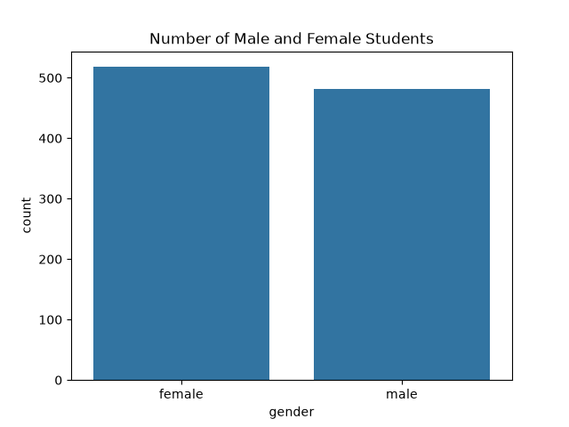
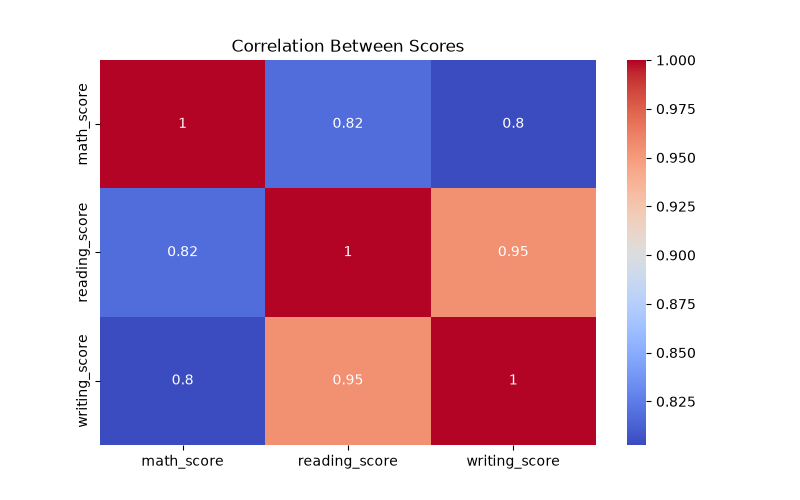
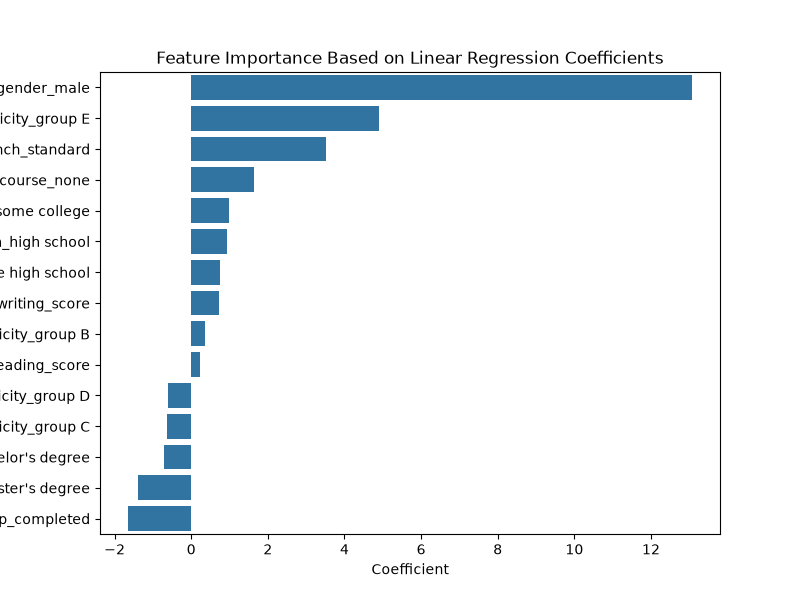
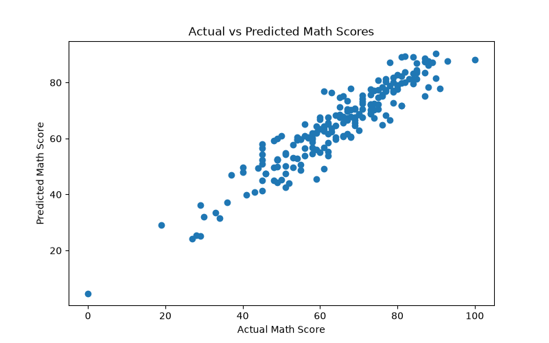
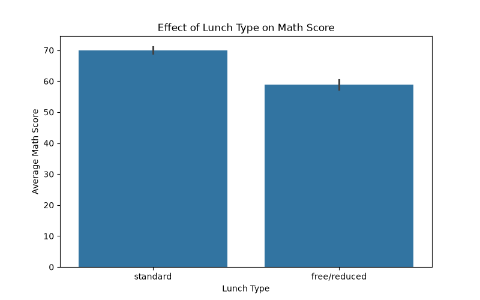
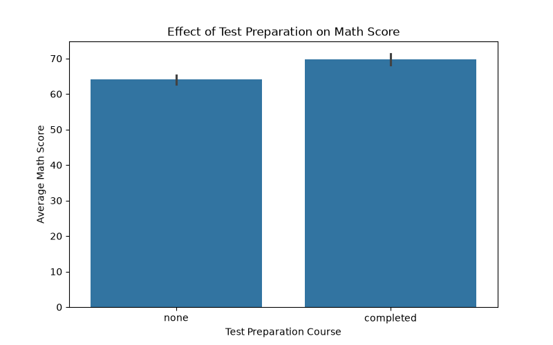

# Student Performance Prediction 📊

## Problem Statement

The objective of this project is to predict a student's mathematics score using demographic and academic information.

The project uses factors such as gender, parental education level, lunch type, test preparation course, reading score, and writing score to analyze student performance and identify important factors affecting mathematics scores.

A Machine Learning regression model using Linear Regression is developed to predict mathematics scores.

---

## Dataset

- **Name:** Students Performance in Exams
- **Source:** Kaggle
- **Link:** https://www.kaggle.com/datasets/spscientist/students-performance-in-exams
- **Rows / Columns:** 1000 rows, 8 columns

The dataset contains information about students' demographic background and academic performance.

### Features:
- Gender
- Race/Ethnicity
- Parental level of education
- Lunch type
- Test preparation course
- Reading score
- Writing score

### Target Variable:
- Math score

---

## Tools Used

- Python
- Pandas
- NumPy
- Matplotlib
- Seaborn
- Scikit-learn
- Jupyter Notebook

---

## Project Workflow

1. Data Collection
2. Data Cleaning and Validation
3. Exploratory Data Analysis (EDA)
4. Feature Engineering
5. Data Encoding
6. Train-Test Split
7. Model Building (Linear Regression)
8. Model Evaluation
9. Feature Importance Analysis

---

## Results

### Model Performance

- **Model:** Linear Regression

### Evaluation Metrics:

- **MAE:** 4.21
- **RMSE:** 5.39
- **R² Score:** 0.88

The model explains approximately 88% of the variation in students' mathematics scores.

---

## Top Factors Affecting Student Performance

- Reading and writing scores show a strong positive relationship with mathematics scores.
- Students who completed the test preparation course generally showed better performance.
- Lunch type shows an association with student academic outcomes.
- Parental education level can influence student learning support and performance.
- Linear Regression coefficients were used to identify important factors affecting predictions.

---

## Project Structure

AIML-Project-RollNo-2302220100190/

├── Dataset/
│ └── StudentsPerformance.csv
│
├── Images/
│ ├── gender_distribution.png
│ ├── correlation_heatmap.png
│ ├── test_preparation.png
│ ├── lunch_vs_math_score.png
│ ├── actual_vs_predicted.png
│ └── feature_importance.png
│
├── Notebook/
│ └── Student_Performance_Prediction.ipynb
│
├── student_performance_model.pkl
│
├── README.md
│
└── requirements.txt

---

## Visualizations

### Gender Distribution

### Correlation Heatmap

### Feature Importance

### Actual vs Predicted Scores

### Lunch Type vs Math Score

### Test Preparation vs Math Score

---

## Future Improvements

- Try other Machine Learning models and compare performance.
- Deploy the model using a simple web application.
- Add more student-related features for better prediction.

---

## Live Demo

Streamlit Application:
https://student-performance-prediction-sr.streamlit.app/

## Conclusion

This project demonstrates a complete Machine Learning workflow for predicting student performance.

The process includes data cleaning, exploratory data analysis, feature engineering, categorical data encoding, model training, evaluation, and feature importance analysis.

The Linear Regression model achieved an R² score of approximately 0.88, showing that academic factors such as reading and writing scores have a strong relationship with mathematics performance.

---

## Author

Supriya Raj